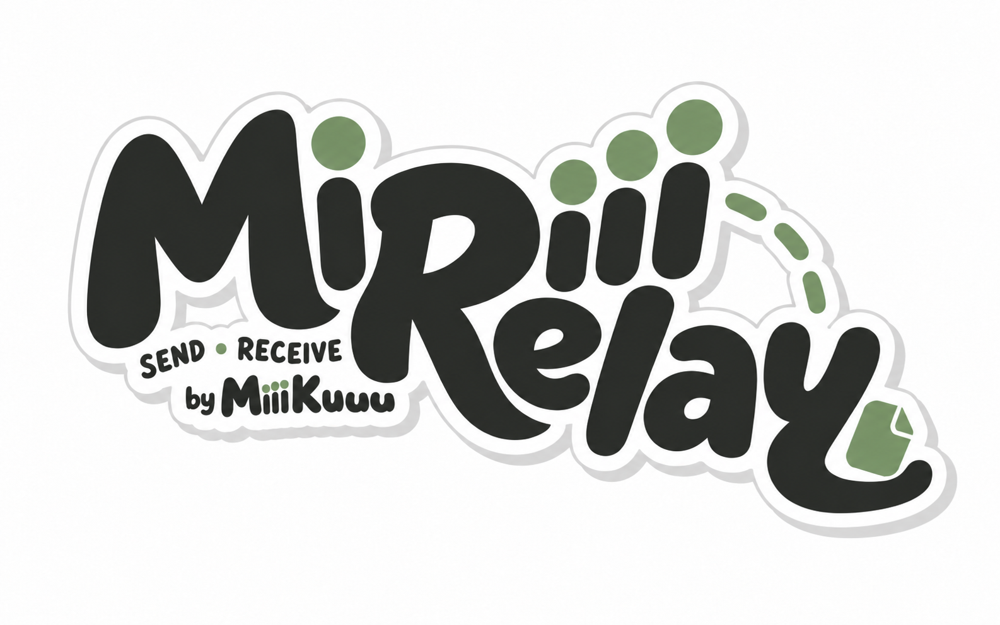

<p align="center">
  
</p>

# MiRelay

Your files. Your devices. Your relay.

MiRelay is a self-hosted, privacy-first file delivery tool. Send files from
Android through your own relay to Linux, with verified delivery, resumable
uploads, and an optional wallpaper workflow for images. It works with non-image
files too.

The project includes a Rust CLI and server, a native GTK Linux app, and a native
Kotlin/Compose Android app sharing the Rust transfer core.

**Development status:** working end-to-end, but still experimental. Directory
sync is explicitly **one-way, Android → Linux**, not a two-way mirror or a backup
guarantee. There is no end-to-end encryption: your relay can read file contents
and metadata. Start with a separate test Folder and keep backups.

## What it does

- Manage multiple **Folders**, each with its own destination and connection.
- Choose local [General / Photos views](docs/folder-categories.md) on Android and
  Linux, with image previews and a separately confirmed Android directory-sync filter.
  The [Linux album](docs/linux-album.md) has a compact virtualized grid and a
  read-only viewer with navigation, zoom and fullscreen controls.
- Browse configured Android sources in a compact [album view](docs/android-album.md),
  with full-screen paging/zoom and a frosted top bar, without starting an upload.
- Pair one sender and one receiver per Folder using a temporary invitation,
  scoped credentials, and a verification-code confirmation before transfers.
  [Scan the Linux invitation QR code](docs/qr-pairing.md) on Android, or enter it manually.
- [Disconnect a Folder](docs/folder-disconnection.md) from either app, revoke both
  devices on the relay, then remove its local entry without deleting your files.
- Select an existing Android directory without moving its files or requiring
  all-files access. Preview and explicitly initialize directory sync against an
  existing Linux directory.
- Preserve original relative paths for new and changed files in directory mode;
  skip matching content and retain previous versions before replacing files.
- Share individual files to Android's MiRelay app, or enable system-scheduled
  automatic checks. Auto is opt-in and is not an always-running service.
- Resume tus uploads after interruption, verify sizes and SHA-256 hashes, write
  atomically, and acknowledge receipt only after durable local storage.
- Use the Linux CLI for scripted delivery and isolated tests. Optionally send
  received images to a wallpaper command without invoking a shell.

Two workflows are available:

| | Directory sync | Delivery only |
| --- | --- | --- |
| Destination | Existing directory, original relative paths | Content-addressed local library |
| Existing files | Preview both sides, then explicitly initialize | Optional initial history sending |
| Later changes | New and modified files | Manual sends, or newly discovered files with Auto |
| Completion on Android | Linux receipt and conflict status | Uploaded to relay; not a Linux receipt |
| Wallpaper action | Not run | Optional, supported images only |

Neither workflow mirrors deletions. A rename creates a new destination path;
the old path remains. Linux-only files are kept. Previous versions and conflict
copies have no automatic retention cleanup yet.

## Get started

### Linux app

Rust **1.88** is the minimum for the locked root and Android-native builds.
`rust-toolchain.toml` pins development and candidate builds to **1.98.1** without
changing rustup's global default. See [toolchains and build validation](docs/toolchains.md)
for the tested matrix, prerequisites and explicit MSRV commands.
See [CI and acceptance boundaries](docs/ci.md) for automated checks and the
separate [release validation status](RELEASE_VALIDATION.md).
The desktop app needs GTK 4.6+, libadwaita, and GLib's resource compiler. On Debian/Ubuntu:

```bash
sudo apt install build-essential pkg-config libgtk-4-dev libadwaita-1-dev libglib2.0-bin
cargo build --locked --release --features desktop --bin mirelay-desktop
./target/release/mirelay-desktop
```

The app has a compact Folder sidebar, file filters and sorting, Folder Path
selection, server pairing, and opt-in automatic receive. Click the MiRelay icon
in the header for the full wordmark and creator credit.

See [Linux app usage](docs/desktop.md) and
[application-menu installation](packaging/linux/README.md). For an isolated UI
playground with synthetic data, see [frontend development](dev/frontend/README.md).

### Android app

Android 8.0+ is supported by the development build, with ARM64 phone and x86_64
emulator native libraries. Read [Android setup](android/README.md) before running
the toolchain bootstrap; downloading the Android SDK requires explicit license
acceptance.

Once the local toolchain is installed:

```bash
bash android/scripts/build.sh :app:assembleDebug
```

The APK is written to `android/app/build/outputs/apk/debug/app-debug.apk`.
This is a debug APK, not a signed distribution release. The repository includes
an isolated emulator setup and real Android runtime tests.

### Your relay

The relay is a Rust HTTP service with SQLite queues and object storage. Deploy it
behind HTTPS. SSH keys are for administering the server; the apps connect through
HTTPS using MiRelay credentials, not SSH.

Build the server for the target host:

```bash
cargo build --locked --release --bin mirelay-server
```

The [deployment helper](deploy/README.md) provides install/upgrade plans,
artifact checks, service templates, backups and health checks. Install and
upgrade are **plan-only unless `--apply` is supplied**. Review the plan first.
There are templates for a domain and for a directly assigned public IPv4 address.
The fresh installer still needs end-to-end validation on each target environment.

Do not expose the HTTP backend publicly or disable certificate verification.
See [server administration](docs/server.md) for configuration and protocol details.

### Pair and initialize an existing directory

1. In Linux, choose **Add Folder**, select the destination **Folder Path**, and
   enable **Directory sync** if you want original paths and later edits synced.
2. Enter the original HTTPS server URL. Under **Pairing → Administrator
   credential**, enter the server's administrator token and click
   **Create on server**. This produces a temporary invitation and a separate
   receiver credential in **Session Token**.
3. In Android, add a Folder using the server URL and invitation. Choose your
   existing source directory. Do not give Android the administrator or receiver
   credential.
4. Compare the verification codes on both devices. Use Linux **Check pairing**
   and **Codes match — confirm**, then refresh Android's pairing state. A
   `pairing_pending` response means this handshake is not finished.
5. On Linux, choose **Review directory…**, inspect the preview and click
   **Initialize**. On Android, open **Directory sync**, choose the source,
   **Preview changes**, and **Initialize sync**.
6. Use Linux **Receive**, or enable **Automatically Receive**. Android's Auto
   checks follow system scheduling and constraints; **Check now** requests an
   earlier check. They are not instant filesystem events.

Linux automatic receive checks approximately every 60 seconds **while the app
is open**. Android periodic checks run approximately every 30 minutes, subject
to network, battery, storage and OS restrictions. Force-stopping Android blocks
automatic work until the app is reopened.

Linux credentials entered in the UI are currently **session-only**. Keep the
receiver token privately or supply the environment variable named in the Folder's
configuration when restarting; keyring persistence is not implemented yet.

Existing delivery-only Folders are not silently converted. Create a separate
paired Folder for directory-mode testing. More details:
[pairing](docs/folder-pairing.md), [Linux directory setup](docs/desktop-directory-sync.md),
[Android directory setup](docs/android-directory-sync.md).

## Try the CLI without a server

The default build needs no GTK libraries. From the repository root, choose an
existing nonempty sample file and use a fresh temporary workspace:

```bash
cargo build --locked
demo_dir="$(mktemp -d -t mirelay-demo-XXXXXX)"

cargo run --locked -- --config "$demo_dir/config.toml" init \
  --data-dir "$demo_dir/data"
cargo run --locked -- --config "$demo_dir/config.toml" mock enqueue ./sample.png
cargo run --locked -- --config "$demo_dir/config.toml" sync
cargo run --locked -- --config "$demo_dir/config.toml" status
cargo run --locked -- --config "$demo_dir/config.toml" list
```

Without overrides, configuration and data use the XDG MiRelay directories,
normally `~/.config/mirelay/` and `~/.local/share/mirelay/`.

For HTTP delivery, initialize with `--server-url https://relay.example.com` and
provide the appropriate receiver credential through `MIRELAY_TOKEN`, or the
environment variable configured in `server.token_env`. Never commit credentials.

Other binaries:

- `mirelay-server`: relay administration and serving.
- `mirelay-upload`: Linux tus sender for transfer and resume testing.
- `mirelay-directory`: experimental directory preview, initialization, send,
  receive and receipt inspection. See its [isolated workflow](docs/directory-sync.md).

## Reliability and safety

Files are streamed into staging, checked for size and SHA-256, flushed to disk,
and atomically committed before receipt state and ACK. Process locks prevent
concurrent operations from updating the same local state. Retries are bounded;
delivery ACKs are idempotent. An individual corrupt delivery does not have to
block the entire queue.

Uploads use tus 1.0 `HEAD` offsets to resume across process restarts. Interrupted
**downloads restart from the beginning**; byte-range download resume is not
implemented. A successful upload alone does not prove Linux receipt.

The current clients accept nonempty files up to **100 MiB**, subject to a lower
server limit. Content signatures determine known media types; unknown formats
fall back to `application/octet-stream`. Extensions are not trusted. Non-image
files are stored and acknowledged without running wallpaper actions.

Directory sync rejects unsafe paths, symlinks and special files. It requires a
Linux filesystem supporting the necessary atomic rename operations. Scans and
inventories are bounded, including a 5,000-path limit and a 4 GiB full-content
scan limit. See [all directory limits](docs/directory-sync.md#limits-and-safety-boundaries).

Android keeps source access read-only and encrypts stored credentials using
Android Keystore. Configuration and desktop registries contain token environment
variable names, not the tokens themselves. There is no advertising, analytics,
or required vendor cloud. Self-hosting and HTTPS do **not** hide plaintext files
or filenames from the relay administrator.

Keep backups of files, configuration and state together. History copies, paused
uploads and verified-object caches can grow; a complete retention/storage UI is
not implemented. Do not delete state to repair a failed handshake or rebind an
existing directory to a different server.

### Optional wallpaper command

Delivery-only configuration accepts an argument array, with `{path}` as a
separate argument. For example, if you already use `swww`:

```toml
[wallpaper]
command = ["swww", "img", "{path}"]
timeout_seconds = 30
```

Commands run without a shell and only after verified image storage and ACK.
If interrupted while a command is running, its outcome becomes `uncertain` and
is not automatically replayed. After deciding that repeating it is safe, use
`mirelay retry --include-uncertain` with the same configuration.

## Development and tests

```bash
cargo fmt --all -- --check
cargo test --locked --features desktop --all-targets
cargo clippy --locked --all-targets --all-features -- -D warnings
python3 -m unittest discover -s deploy -p 'test_*.py' -v
bash android/scripts/build.sh :app:assembleDebug :app:testDebugUnitTest :app:lintDebug
```

Graphical-session, JNI and emulator tests are opt-in and documented separately.
They cover actual local HTTP/tus round trips, process death, interrupted uploads,
ACK recovery, pairing permissions, directory conflicts, UI guards and Android
scheduling. A passing debug/emulator suite is not a production performance or
all-device compatibility guarantee.

The [2026-09-08 Android regression report](docs/android-source-diagnostics-2026-09-08.md)
covers source diagnostics and a database deadlock fix: 51 JVM tests, 57 emulator
tests, and two process-interruption recovery scenarios passed. The subsequent
[physical-phone empty-file test](docs/phone-empty-file-2026-09-08.md) verified both
recovery paths through the real relay and Linux receiver. Unattended screen-off
periodic Auto remains unverified; see the [broader phone acceptance report](docs/phone-acceptance-2026-09-08.md).
Earlier brand integration and cross-platform results are recorded in the
[2026-09-06 verification report](docs/brand-integration-2026-09-06.md).

## Documentation and credits

- [Android app and emulator](android/README.md)
- [Linux desktop](docs/desktop.md)
- [Folder pairing](docs/folder-pairing.md)
- [Directory protocol and limits](docs/directory-sync.md)
- [HTTP API](docs/http-api-v1.md) and [server](docs/server.md)
- [Deployment scripts](deploy/README.md)
- [Original brand kit and integration](assets/brand/README.md)

Some implementation notes and historical QA reports in `docs/` are in Chinese;
dated reports describe the build tested at that time.

Created by **MiiiKuuu**. The supplied MiRelay logo and wordmark are preserved
with their original proportions, colors, signature and file illustration.
